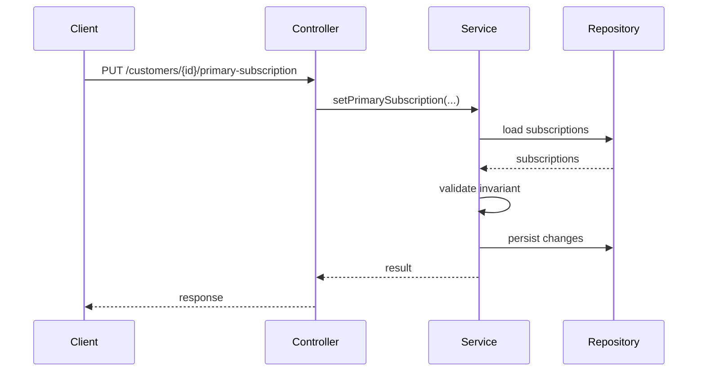

````markdown
---
name: technical-design
description: Transform a validated requirement or conceptual analysis into an implementation-ready technical design covering architecture, components, data, APIs, dependencies, consistency, risks, and implementation strategy.
---

# Technical Design

Produce a concrete technical design for a feature, change, ticket, or subsystem before implementation begins.

This skill translates business and conceptual requirements into a technical solution that is:

- understandable;
- implementable;
- maintainable;
- consistent with the existing codebase;
- explicit about trade-offs;
- explicit about risks;
- proportional to the complexity of the change.

The objective is not to produce code.

The objective is to answer:

> How should this requirement be implemented in this system?

---

# Preferred input

When available, use an existing conceptual analysis as the primary business input.

Preferred source:

```text
docs/conceptual-analysis/
````

A technical design may also be produced directly from:

* a Jira ticket;
* a feature request;
* user requirements;
* existing documentation;
* source code;
* an issue description.

If important business questions remain unresolved, expose them instead of silently making technical assumptions.

Do not compensate for an incomplete conceptual model by inventing business rules.

---

# Language

Write the technical design in the same language as the user's request unless another language is explicitly requested.

Use the project's existing technical terminology when available.

Code symbols, class names, endpoint names, table names, and existing identifiers must preserve their original spelling.

---

# When to use this skill

Use this skill when the user needs to determine how a requirement should be implemented.

Typical situations include:

* implementing a new feature;
* changing an existing business workflow;
* introducing a new API;
* modifying persistence;
* adding an integration;
* changing module boundaries;
* adding asynchronous behavior;
* introducing a new state transition;
* modifying a domain model;
* planning a non-trivial refactoring;
* preparing implementation work from a conceptual analysis.

---

# When NOT to use this skill

Do not perform a full technical design for trivial changes such as:

* changing a label;
* changing a color;
* renaming a local variable;
* updating a static text;
* correcting a typo;
* applying an obvious one-line fix.

If the change has architectural, persistence, API, concurrency, integration, or business impact, the skill may still be relevant.

---

# Core principles

## Understand the existing system before designing

Do not design a solution in isolation when project context is available.

Inspect the relevant existing architecture first.

Prefer adapting to existing structures over introducing parallel mechanisms.

Before proposing new abstractions, search for:

* existing domain concepts;
* existing services;
* existing modules;
* existing repositories;
* existing APIs;
* existing event mechanisms;
* existing error handling;
* existing persistence patterns;
* existing integration patterns;
* existing transaction boundaries;
* existing tests.

Do not create a second architectural path when the project already provides an appropriate one.

---

## Prefer the simplest viable design

Do not introduce complexity for hypothetical future requirements.

Avoid unnecessary:

* interfaces;
* factories;
* strategies;
* adapters;
* wrappers;
* layers;
* event buses;
* generic frameworks;
* asynchronous processing;
* distributed components.

Every abstraction must solve a real problem.

Do not reward architectural sophistication for its own sake.

---

## Separate requirements from technical decisions

Clearly distinguish:

### Requirement

Something the system must guarantee.

Example:

> Only one active subscription may be the primary subscription for a customer.

### Technical decision

How the system will guarantee it.

Example:

> Enforce uniqueness transactionally when changing the primary subscription.

The technical design may choose implementation mechanisms, but the reason for each important decision must remain clear.

---

## Reuse before creating

Before introducing a new:

* service;
* repository;
* entity;
* DTO;
* endpoint;
* table;
* event;
* module;
* abstraction;

check whether an existing one already owns the responsibility.

New structures should have a clear reason to exist.

---

# Required analysis process

Follow this order.

## 1. Understand the requirement

Summarize the requested change.

Identify:

* desired behavior;
* actors;
* domain concepts;
* business rules;
* invariants;
* known constraints;
* unresolved questions.

If a conceptual analysis exists, use it instead of reconstructing the domain model unnecessarily.

---

## 2. Inspect the existing implementation

When codebase access is available, inspect the relevant existing code.

Determine:

* where similar behavior currently lives;
* which module owns the responsibility;
* relevant entry points;
* domain objects;
* application services;
* repositories;
* persistence structures;
* external integrations;
* API contracts;
* tests;
* transaction boundaries.

Do not design only from filenames.

Read relevant source files.

---

## 3. Define the technical scope

Identify what the change is expected to affect.

Possible areas include:

* domain;
* application services;
* API;
* persistence;
* database;
* messaging;
* jobs;
* integrations;
* frontend contract;
* security;
* configuration;
* tests;
* migrations.

Also explicitly identify areas that should remain unchanged when relevant.

---

## 4. Define the proposed design

Describe the target technical behavior.

Explain:

* where the new responsibility belongs;
* which existing components change;
* which new components are necessary;
* how data flows through the system;
* where business decisions are executed;
* where side effects occur.

Keep the design concrete enough to implement.

Avoid vague statements such as:

> Add a service to manage this.

Explain which responsibility that service owns and why.

---

## 5. Define components and responsibilities

For every important component affected or introduced, describe:

* name;
* type;
* responsibility;
* dependencies;
* inputs;
* outputs;
* whether it is new or existing.

Example:

```text
PrimarySubscriptionService

Type:
Application service

Responsibility:
Coordinate changes to a customer's primary subscription.

Dependencies:
- SubscriptionRepository
- CustomerRepository

Does not own:
- HTTP parsing
- persistence implementation
- notification delivery
```

Do not create components merely to fill a template.

---

## 6. Define execution flow

Describe important runtime flows step by step.

Example:

```text
HTTP request
    ↓
Controller
    ↓
Application service
    ↓
Load customer subscriptions
    ↓
Validate business invariant
    ↓
Update primary subscription
    ↓
Persist changes
    ↓
Return updated representation
```

Use sequence diagrams when useful.

Mermaid may be used.

Example:



Do not create diagrams that add no information.

---

## 7. Define data changes

When persistence is affected, describe:

* existing data involved;
* new fields;
* modified fields;
* new entities or tables;
* relationships;
* constraints;
* indexes;
* migration requirements;
* compatibility with existing data.

Do not invent schema changes when they are unnecessary.

Explicitly identify whether a migration is required.

---

## 8. Define API changes

When an API is affected, describe:

* endpoint;
* method;
* request;
* response;
* status codes;
* validation;
* error behavior;
* backward compatibility.

Example:

```text
PUT /customers/{customerId}/primary-subscription

Request:
{
  "subscriptionId": "..."
}

Response:
200 OK

Errors:
400 — invalid request
404 — customer or subscription not found
409 — operation violates business state
```

Use the project's existing API conventions.

Do not redesign the entire API surface unless required.

---

## 9. Define domain and application logic placement

Explicitly state where important rules belong.

For each significant rule, identify its technical owner.

Example:

```text
Rule:
A customer may have at most one active primary subscription.

Technical owner:
PrimarySubscriptionService

Enforcement:
Validated during primary-subscription changes and protected by the persistence consistency strategy.
```

Avoid scattering the same rule across:

* controllers;
* frontend;
* database;
* services;

without a clear authoritative source.

---

## 10. Define transaction boundaries

When multiple operations must succeed or fail together, describe the expected transaction boundary.

Identify:

* operations included;
* failure behavior;
* consistency requirements.

Example:

```text
Changing the primary subscription requires:
1. removing the current primary marker;
2. assigning the new primary marker.

Both operations must belong to the same transaction.
```

Do not add transactions mechanically.

Use them when consistency requires them.

---

## 11. Analyze concurrency

When simultaneous operations may affect correctness, identify:

* race conditions;
* lost updates;
* duplicate processing;
* conflicting state changes;
* uniqueness violations.

For each relevant risk, define a technical strategy.

Possible strategies include:

* optimistic locking;
* pessimistic locking;
* database constraints;
* idempotency keys;
* compare-and-set;
* serialization;
* transactional uniqueness.

Choose based on the actual problem.

Do not introduce distributed locking when a local database guarantee is sufficient.

---

## 12. Analyze idempotency

When operations may be retried, determine whether they must be idempotent.

Relevant cases include:

* APIs;
* jobs;
* queues;
* webhooks;
* payment operations;
* external callbacks.

Describe:

* expected duplicate behavior;
* identification mechanism;
* persistence strategy if required.

Do not add idempotency infrastructure when duplicate execution is impossible or harmless.

---

## 13. Define error handling

Identify meaningful failure cases.

Examples:

* invalid state;
* missing resource;
* authorization failure;
* persistence conflict;
* external dependency failure;
* timeout;
* concurrency conflict.

Define how each failure propagates through the system.

Prefer existing project error conventions.

Avoid exposing internal technical details through public APIs.

---

## 14. Analyze external dependencies

When external systems are involved, identify:

* dependency;
* direction;
* expected contract;
* timeout behavior;
* retry behavior;
* failure behavior;
* fallback behavior;
* idempotency implications.

Do not automatically add retries.

Retries are only valid when operations are safe to repeat.

---

## 15. Analyze security and authorization

When relevant, identify:

* who may execute the operation;
* authentication assumptions;
* authorization rules;
* sensitive data;
* privilege boundaries;
* data exposure risks.

Do not invent permissions that are not part of the requirement.

If authorization requirements are unknown, expose them as an open question.

---

## 16. Analyze observability

Only include observability requirements that are operationally useful.

Consider:

* structured logs;
* metrics;
* traces;
* alerts;
* audit logs.

Do not propose logging every method call.

Focus on events useful for diagnosing production behavior.

Example:

```text
Log:
- failed primary-subscription changes;
- concurrency conflicts;
- rejected operations caused by invalid domain state.

Metric:
- number of primary-subscription changes;
- number of conflicts.
```

---

## 17. Define testing strategy

Describe what needs to be tested.

Focus on meaningful behavior.

Possible categories:

### Unit tests

For isolated business rules.

### Integration tests

For persistence, transactions, or infrastructure boundaries.

### API tests

For public contracts.

### Concurrency tests

When invariants depend on simultaneous operations.

### Migration tests

When data transformation is required.

Do not attempt to enumerate every possible test method.

Focus on scenarios that protect important behavior.

---

## 18. Analyze compatibility and migration

When changing existing behavior, analyze:

* backward compatibility;
* existing clients;
* existing data;
* rolling deployment concerns;
* migration order;
* schema compatibility;
* feature flags if needed;
* rollback implications.

Do not introduce compatibility complexity for systems that do not need it.

---

## 19. Analyze failure and rollback

For risky changes, identify:

* partial failure scenarios;
* rollback options;
* irreversible data changes;
* deployment ordering;
* recovery strategy.

Keep the depth proportional to the risk of the feature.

---

## 20. Identify alternatives

For meaningful architectural decisions, consider realistic alternatives.

Use:

```text
Option A
Option B
```

Only when there are genuinely competing designs.

For each option, explain:

* advantages;
* disadvantages;
* complexity;
* impact on existing architecture.

Then state the selected option.

Do not create artificial alternatives for obvious decisions.

---

## 21. Record important decisions

For major decisions, use:

```markdown
### TD-01 — <Decision>

**Decision:**  
...

**Reason:**  
...

**Alternatives considered:**  
...

**Consequences:**  
...
```

Only create decision records for choices that materially affect implementation or future maintenance.

---

## 22. Identify implementation risks

List concrete technical risks.

Examples:

* migration of legacy data;
* concurrency race;
* API incompatibility;
* external dependency instability;
* performance regression;
* large transaction scope;
* duplicated source of truth.

Classify risks as:

```text
HIGH
MEDIUM
LOW
```

Do not classify cosmetic concerns as technical risks.

---

## 23. Produce implementation steps

End the design with an implementation sequence.

The sequence should be concrete enough for a developer or coding agent to follow.

Example:

```text
1. Add the primary-subscription operation to the application layer.
2. Add repository support required by the operation.
3. Add consistency enforcement.
4. Expose the operation through the existing customer API.
5. Add migration if required.
6. Add unit and integration tests.
7. Add concurrency test.
8. Update documentation.
```

Order steps according to dependencies.

Do not include trivial actions such as:

```text
Open the IDE.
Create a branch.
Run the formatter.
```

---

# Technical design quality rules

## Avoid unnecessary layers

Do not automatically create:

```text
Controller
    ↓
Facade
    ↓
Manager
    ↓
Service
    ↓
Handler
    ↓
Repository
```

If:

```text
Controller
    ↓
Service
    ↓
Repository
```

is sufficient, prefer the simpler design.

---

## Avoid meaningless interfaces

Do not introduce an interface simply because a class exists.

An interface is useful when it provides meaningful:

* dependency inversion;
* multiple implementations;
* boundary isolation;
* test substitution;
* plugin behavior.

Avoid:

```text
UserService
UserServiceImpl
```

when the interface has no architectural purpose.

---

## Avoid generic abstractions too early

Do not generalize a solution for hypothetical future cases.

Prefer solving the current requirement cleanly.

Example:

Avoid building:

```text
GenericEntityStateTransitionEngine<T, S, C>
```

when the requirement only needs one clear subscription state transition.

---

## Preserve business invariants

Every invariant identified by the conceptual analysis must have an identifiable enforcement strategy.

For each invariant, the design should make clear:

* where it is checked;
* when it is checked;
* how concurrent changes are handled if relevant.

---

## Minimize sources of truth

Avoid representing the same business state in multiple independent places.

If duplication is unavoidable, define:

* authoritative source;
* synchronization mechanism;
* failure behavior.

---

## Keep side effects visible

Important side effects should be explicit.

Examples:

* database writes;
* email sending;
* external API calls;
* event publication;
* file writes;
* cache invalidation.

Do not hide important side effects inside unexpected utility methods.

---

# Markdown deliverable

Always produce a Markdown technical design when filesystem access is available.

Use:

```text
docs/technical-design/
```

Create the directory if necessary.

---

## File naming

When a ticket identifier exists, include it.

Examples:

```text
docs/technical-design/JIRA-142-primary-subscription.md
docs/technical-design/PROJ-381-invoice-cancellation.md
```

Without a ticket identifier:

```text
docs/technical-design/primary-subscription.md
```

Avoid generic names such as:

```text
design.md
technical.md
solution.md
```

unless no meaningful name can be inferred.

If a technical design already exists for the same feature, update it instead of creating unnecessary duplicates.

Do not overwrite an unrelated design.

---

# Required document structure

Use the following structure.

Omit sections that are genuinely irrelevant.

```markdown
# Technical Design — <Feature>

**Status:** Draft
**Source:** <ticket / conceptual analysis / request>
**Ticket:** <identifier when available>
**Technical readiness:** <Partial | Ready for implementation>

## Summary

<Short technical summary.>

## Requirements

### Business requirements

- ...

### Invariants

- ...

### Technical constraints

- ...

## Existing architecture

<Relevant current implementation and components.>

## Scope

### In scope

- ...

### Out of scope

- ...

## Proposed design

<Overall solution.>

## Components

### <Component>

**Type:**  
...

**Status:** Existing / New / Modified

**Responsibility:**  
...

**Dependencies:**  
...

## Execution flow

...

## Data model

...

## Persistence changes

...

## API changes

...

## Business rule placement

| Rule / invariant | Technical owner | Enforcement |
|---|---|---|
| ... | ... | ... |

## Transactions

...

## Concurrency

...

## Idempotency

...

## Error handling

...

## External integrations

...

## Security and authorization

...

## Observability

...

## Testing strategy

### Unit tests

- ...

### Integration tests

- ...

### API tests

- ...

### Other

- ...

## Migration and compatibility

...

## Failure and rollback

...

## Technical decisions

### TD-01 — <Decision>

**Decision:**  
...

**Reason:**  
...

**Alternatives considered:**  
...

**Consequences:**  
...

## Risks

### R-01 — <Risk>

**Severity:** HIGH / MEDIUM / LOW

**Risk:**  
...

**Mitigation:**  
...

## Implementation plan

1. ...
2. ...
3. ...

## Open questions

### Blocking

1. ...

### Non-blocking

1. ...

## Readiness

**Ready for implementation:** Yes / No

**Reason:**  
...
```

---

# Technical readiness

Set:

```text
Technical readiness: Partial
```

when important technical or business decisions remain unresolved.

Set:

```text
Technical readiness: Ready for implementation
```

only when a developer should be able to implement the feature without making significant undocumented architectural decisions.

Minor implementation details do not block readiness.

---

# Completion response

After producing the technical design, respond concisely with:

* feature or ticket analyzed;
* proposed architecture;
* main components affected;
* major technical decision;
* highest technical risk;
* whether implementation is ready;
* path to the Markdown file.

Example:

```text
Technical design completed: JIRA-142

Approach:
- Extend the existing subscription application service.
- Keep the primary-subscription invariant in the application/domain boundary.
- Enforce concurrent consistency at persistence level.

Main affected components:
- SubscriptionService
- SubscriptionRepository
- Customer API

Main risk:
- Concurrent primary-subscription updates.

Ready for implementation: Yes

Design:
docs/technical-design/JIRA-142-primary-subscription.md
```

Do not duplicate the complete technical design in the conversation after successfully writing the Markdown file.

If filesystem access is unavailable, return the complete Markdown technical design directly.

---

# Quality checklist

Before completing the design, verify that:

* the business requirement is understood;
* existing code was inspected when available;
* existing architecture was reused where appropriate;
* unnecessary abstractions were avoided;
* component responsibilities are clear;
* dependency direction is understandable;
* business invariants have enforcement strategies;
* data changes are explicit;
* API changes are explicit;
* transaction boundaries are clear when relevant;
* concurrency has been considered when relevant;
* idempotency has been considered when relevant;
* error behavior is defined;
* external dependency failures are considered;
* security is considered when relevant;
* tests protect important behavior;
* migration and compatibility are considered when relevant;
* important technical decisions are justified;
* risks are explicit;
* implementation steps are ordered and concrete;
* blocking questions are clearly separated;
* no lint or cosmetic concerns polluted the design;
* the design is proportional to the complexity of the feature;
* a developer could implement the change without inventing major architectural decisions.

The objective is not to design the most sophisticated solution.

The objective is to produce the simplest technically sound design that satisfies the requirement and fits naturally into the existing system.